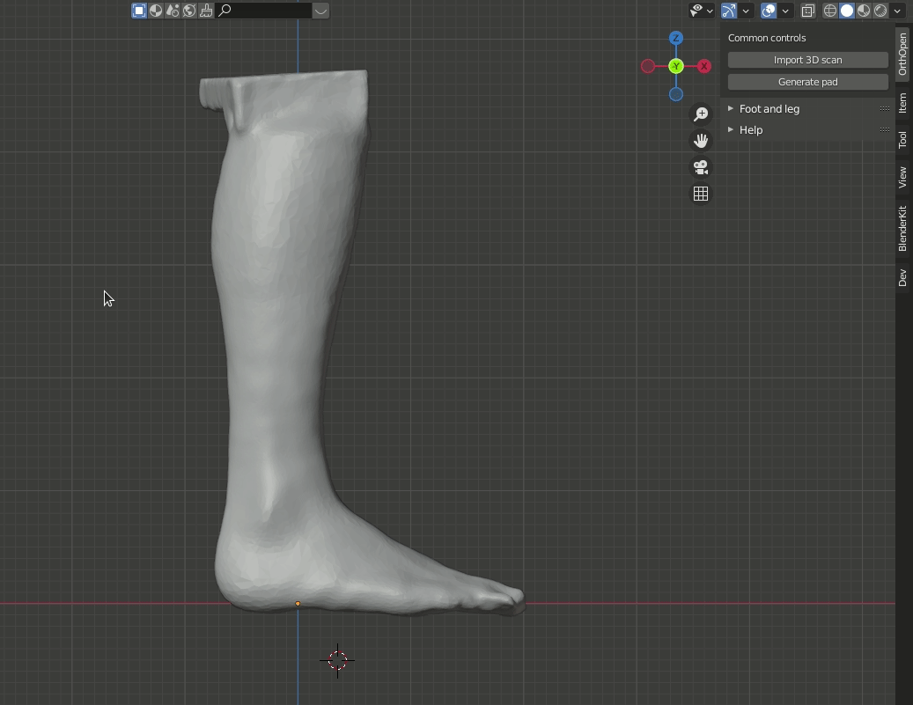

OrthOpen is a free, open source add-on in Blender for facilitating the design of orthopedic aids such as orthoses.  Our
goal is to make it easier, faster and more cost-efficient (Blender is free) for orthopedic specialists worldwide to help
their patients.



This page is aimed towards developers. A user guide if found [here](https://ota3d.github.io/orthopen/).

## Getting started 
Clone the repository. This repository uses Git LFS so you also need to issue 
```bash
git lfs pull 
```
With the souce code downloaded, the easiest way altogheter to install the add-on in blender starting working with the
source code is probably to use Visual Studio Code with the [Blender Development extension](https://marketplace.visualstudio.com/items?itemName=JacquesLucke.blender-development)
There should be an instruction for how get started in the in the link.

### Other material
Guides that might be useful when getting started developing a Blender add-on. 
[Create Simple Blender Addon in 15Minutes](https://www.youtube.com/watch?v=Y67eCfiqJQU) 
[Setup vscode for blender](https://www.youtube.com/watch?v=bmpKAluHiEc)

### Tips 
- Activate Python Tooltips from *User Preferences > Interface*

## Naming conventions 
We use the conventions proposed by Blender: [Blender 2.80: Addon
API](https://wiki.blender.org/wiki/Reference/Release_Notes/2.80/Python_API/Addons) and PEP8. The Blender conventions
partly conflict those of PEP8. In case of a conflict Blender conventions take precedence over PEP8

## Git conventions 
- Work in feature branches. When a feature branch is tested this feature is merged to *master*. The latest commit of
   branch *master* should always clean and ready for a release or a pull. So, only put finished features there. 
- Increment the version number in *__init__.py* by 0.1 for each merge to master that noticeably would change the user
  experience. The increment may be amended to the merge commit.
- Use explicit merge commit in *master*, even if a fast-forward would have been possible. This is because that we think
  that makes history more traceable. 
-[Commit message guidelines](https://www.git-scm.com/book/en/v2/Distributed-Git-Contributing-to-a-Project#_commit_guidelines)

## Design philosophy
The user of this plugin is assumed to be a novice at Blender. The goal is that the user only should have to be able to
navigate the viewport and do basic operations on objects such and move and scale. Everything else should be possible to
do using high level functions provided by the add-on.

## Contact
For technical matters contact Martin Pär-Love Palm, parlove@paxec.se
