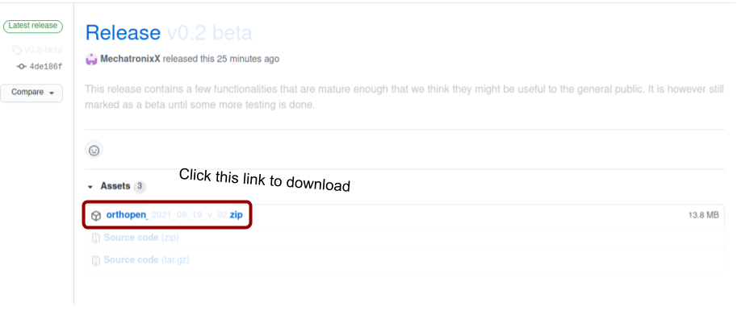
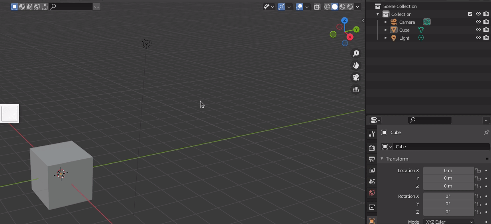
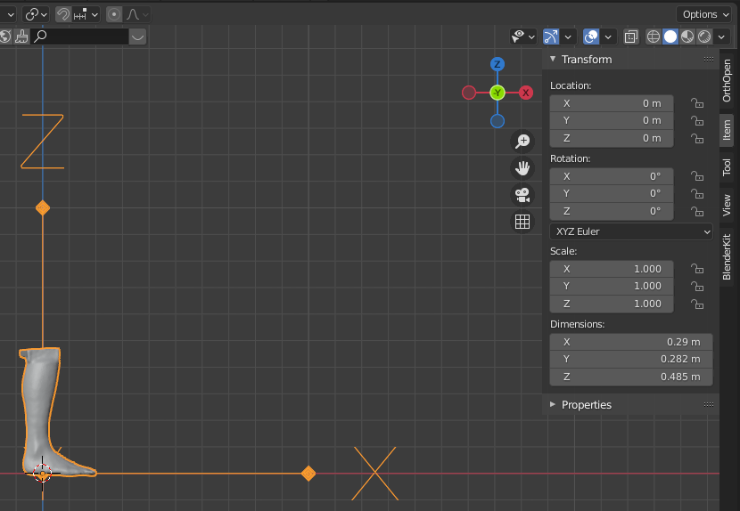
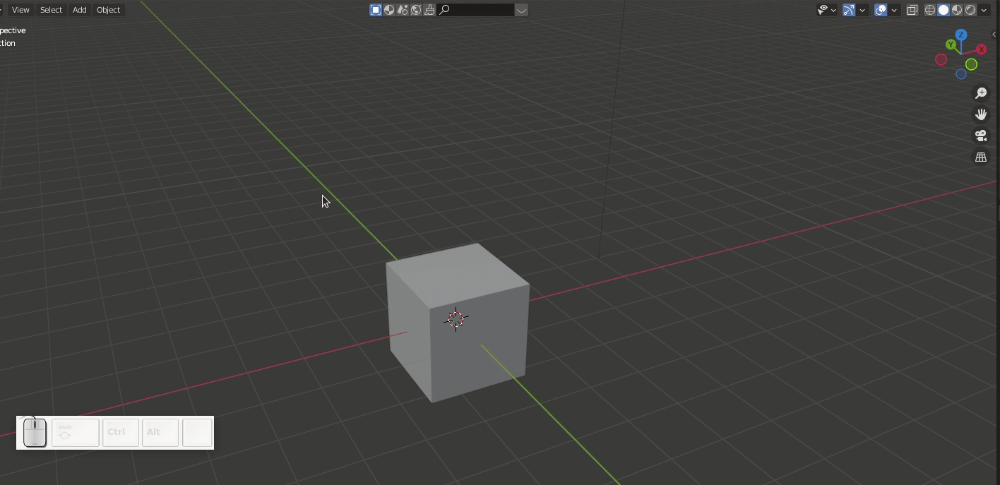

OrthOpen is a free, open source add-on in Blender for facilitating the design of orthopedic aids such as orthoses.  Our
goal is to make it easier, faster and more cost-efficient (Blender is free) for orthopedic specialists worldwide to help
their patients. Our current design focus is handling 3D scans of patients and designing orthoses that can be manufactured by
CNC equipment and 3D printers.

> **_NOTE:_**  Orthoses and such may only be recommended to a patient by a medical professional.

# Installation
First, [install Blender](https://www.blender.org/download/). If you are using Linux, it is recommended to install it
using a tar-ball into a folder where you have full privilegies. 

Our goal for this add-on is that a user mostly should only have to know how the most basic operations in Blender. 
Here is an official guide that might help with that: [Viewport Navigation - Blender 2.80 Fundamentals](https://www.youtube.com/watch?v=ILqOWe3zAbk&ab_channel=Blender)  

Now, [download](https://github.com/OTA3D/orthopen/releases/latest)  the latest release of OrthOpen from
[https://github.com/OTA3D/orthopen/releases/latest](https://github.com/OTA3D/orthopen/releases/latest) Clicking the link
will take you to a page that looks similar to below. Download the file as indicated in the image below.

The add-on is installed in Blender like any other zip file add-on. Follow for instance [this tutorial](https://www.youtube.com/watch?v=LzdoUTvAgXk&ab_channel=TheCGEssentials) 
 on how to install an add-on in Blender.

## Locating OrthOpen
With the add-on installed, press *N* in viewport. You should now see the main menu of Orthopen pop-up to the right.

# General usage
Our goal is to provide most of the needed support via tooltips. You see tooltips by hovering the various functions in the add-on menu. Is it enough to only explain 
these features via tooltips or should we write something more in this guide? Let us know by providing us infomation in a [GitHub issue](https://github.com/OTA3D/orthopen/issues) 

## Proper alignment
Currently, most features are designed for operating on a 3D scan of a leg. It is very important that the leg is aligned correctly before starting.
Location and rotation should all be 0, and scale should be 1. At these conditions, the toes should point in the x-direction and 
the leg in the z-direction. 

Also, the leg should be its natural size, i.e. not enlarged to something very small or large. The scan in the screenshot
below has a height of around 0.3 meters. 

### Correcting alignment
If the imported scan is not aligned as specified above, rotate it to its proper alignment. Then, apply the transform by *Object->Apply->All transforms*. An example 
of this is demontrated in the animation below.

