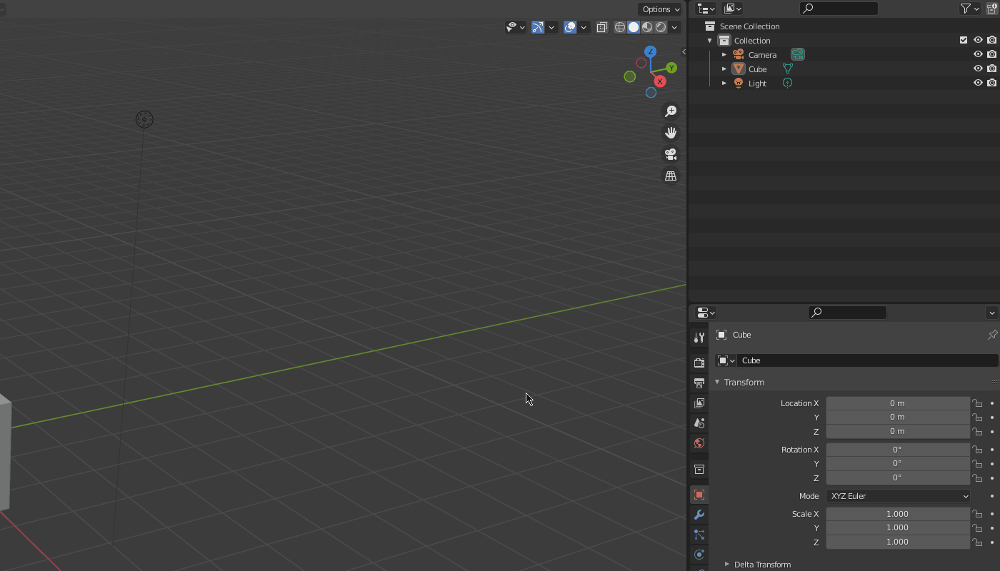

OrthOpen is a free, open source add-on in Blender for facilitating the design of orthopedic aids such as orthoses.  Our
goal is to make it easier, faster and more cost-efficient (Blender is free) for orthopedic specialists worldwide to help
their patients. Our current design focus is handling 3D scans of patients and designing orthoses that can be manufactured by
CNC equipment and 3D printers.

> **_NOTE:_**  Orthoses and such may only be recommended to a patient by a medical professional.

- [Installation](#installation)
  - [Locating OrthOpen](#locating-orthopen)
- [General usage](#general-usage)
  - [Proper alignment](#proper-alignment)
    - [Correcting alignment](#correcting-alignment)

# Installation
First, [install Blender](https://www.blender.org/download/). If you are using Linux, it is recommended to install it
using a tar-ball into a folder where you have full privilegies. 

Our goal for this add-on is that a user mostly should only have to know how the most basic operations in Blender. 
Here is an official guide that might help with that: [Viewport Navigation - Blender 2.80 Fundamentals](https://www.youtube.com/watch?v=ILqOWe3zAbk&ab_channel=Blender)  

Now, [download](https://github.com/OTA3D/orthopen/releases/latest)  the latest release of OrthOpen from
[https://github.com/OTA3D/orthopen/releases/latest](https://github.com/OTA3D/orthopen/releases/latest) Clicking the link
will take you to a page that looks similar to below. Download the file as indicated in the image below.

The add-on is installed in Blender like any other zip file add-on. Follow for instance [this tutorial](https://www.youtube.com/watch?v=LzdoUTvAgXk&ab_channel=TheCGEssentials) 
 on how to install an add-on in Blender.

# General usage
Our goal is to provide most of the needed support via tooltips. You see tooltips by hovering the various functions in the add-on menu. Is it enough to only explain 
these features via tooltips or should we write something more in this guide? Let us know by providing us infomation in a [GitHub issue](https://github.com/OTA3D/orthopen/issues) 

## Locating OrthOpen
With the add-on installed, press *N* in viewport. You should now see the main menu of Orthopen pop-up to the right.

## Proper alignment
Currently, most features are designed for operating on a 3D scan of a leg. It is very important that the leg is aligned correctly before starting.
Location and rotation should all be 0, and scale should be 1. At these conditions, the toes should point in the x-direction and 
the leg in the z-direction.

Also, the leg should be its natural size, i.e. not enlarged to something very small or large. The scan in the screenshot
below has a height of around 0.5 meters. 

## Correcting alignment
If the imported scan is not aligned as specified above. When a leg is imported a sole is shown in order to guide the user to adjust the object into the correct position. Once the object is in the correct place click the "Transform All" button
of this is demontrated in the animation below.

# Menu
Below is a walk through of each function in OrthOpen.

## Common controls
### Import 3D scan
Opens a dialog for importing 3D scans. Use this instead of Blenders own import function.

### Generate pad
Interactively generate a pad that sticks to surfaces. Hover the object where it should be centered and click left mouse button. Can be used to  ensure clearance between an ankle and a foot splint.

## Foot and leg
### Mirror 3D-model
Shortcut button to mirrors the selected object along the Y-axis. In case a left leg has been imported but right leg needs a cosmetic/orthosis.

### Transform all (Meshes)
Shortcut button for transform all meshes. Should be used once the imported object are in the correct place.
Same as the menu option: Object -> Apply -> All Transform.

## Adjust foot angl
### Adjust foot angle
Click on the ankle. Then rotate the foot by moving the visible handle (armature) that is added to the foot.

### Apply changes
Permanently apply modifiers (e.g. changed foot angle) to the selected object. Will try to automtically find relevant objects if no object is selected.

## Prosthesis cosmetics
Generate a proposal for leg prosthesis cosmetics. Has additional options in the sub-menu which will be shown once this button is clicked.

- Calf circumference (max): Adjusts the cosmetic to the given circumference around the calf.
- Cosmetics total height: The height of the cosmetic.
- Clip start height: The center point of the fastening clip measured relative to the lowest point of the cosmetic.
- Interactive clip placement: With this option active the user will be asked to interactively place where the cosmetic should be located.

## Foot splint
### Generate toe box
Generate a box around the toes. Used to ensure clearence between toes and the foot splint. Selecting a leg or a foot first is required.

## Generate foot splint
Generate a foot splint. Beta version that just import a 3D model to the scene.

## Help
### Report an issue
Link to the Git repository web page where issues shall be reported.

### User guide
Link to the user guide web page.